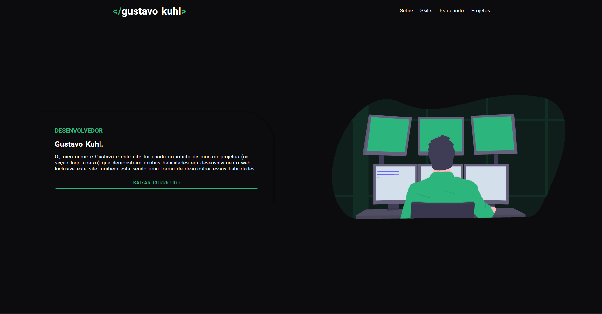

<h1 align="center">
  📰 Meu Portfólio
</h1>

<h4 align="center">
  Portfólio criado com o intuito de mostrar meus projetos ao decorrer da minha carreira.
</h4>

<h4 align="center"><a href="https://gustavo-kuhl.github.io/Portifolio/src/html/index.html">Clique para visitar o projeto</a></h4>

## 💼 Tecnologias utilizadas
Para o desenvolvimento deste site utilizei as seguintes tecnologias:

- HTML;
- Sass;
- JavaScript;
- ScrollReveal;
